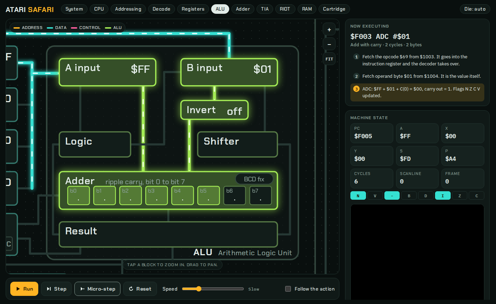
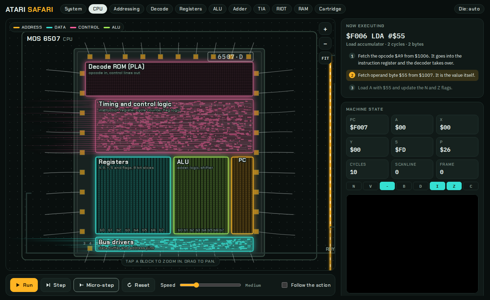
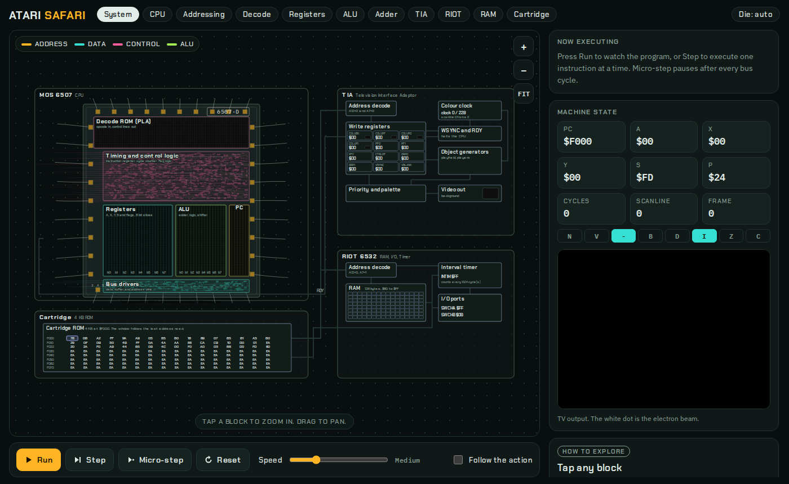
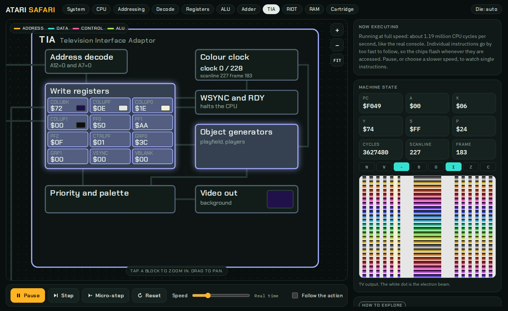

# Atari Safari

An interactive simulator of the original Atari 2600 chipset. Run a program and watch the 6507 CPU, the TIA video chip and the RIOT light up wire by wire, then zoom from the whole console down into the ALU, the registers and the individual bit cells of the adder.

**[Live demo](https://hirosakuraba.github.io/Atari-Safari/)**



*Mid-way through `ADC #$01` with `A = $FF`: the operands have reached the adder and the carry is rippling from bit 0 upwards.*

## What it does

- Runs real 6502 machine code on an instruction-accurate 6507 model, with the TIA and RIOT attached and a 4 KB cartridge on the bus.
- Turns every instruction into a sequence of bus cycles and lights the parts involved: program counter, address register, address and data buses, the chip that answers, the instruction register and decoder, the registers, the ALU operand latches, the adder, logic unit and shifter, and the flags.
- Lets you zoom into any block. Semantic zoom reveals more detail as you get closer: the eight full-adder cells, the 128 RAM cells, the TIA write registers and a hex window into the ROM that follows the last address fetched.
- Draws the picture the TIA produces on a small TV, with the electron beam shown as a dot.
- Includes a small assembler, so you can edit a program and reload it.

The CPU view is drawn as a toy floorplan of the 6507 die: the decode ROM band across the top, random control logic below it, the datapath as vertical bit slices with the registers, ALU and program counter, and bond pads round the edge. Regions glow as their parts work. Zoom in and the die fades into the block schematic; the **Die** button pins either view. The art is original vector work, not a photograph.



Colour is a signal: amber wires carry addresses, teal wires carry data, pink wires are control, green wires are inside the ALU, and violet marks the peripheral chips.

| Overview | ALU | TIA and picture |
| --- | --- | --- |
|  |  |  |

It also works on a phone, where the schematic sits on top with the controls and notes below it.

## Try it

Open the live demo, or run it yourself. There is nothing to install and no build step to run it: the app is a single file.

```sh
git clone https://github.com/HiroSakuraba/Atari-Safari.git
cd Atari-Safari
open index.html          # or double-click it, or:
python3 -m http.server   # then visit http://localhost:8000
```

Fonts (Chakra Petch, IBM Plex) load from Google Fonts. Offline, the page falls back to system fonts and works the same.

### Publishing on GitHub Pages

In the repository, go to **Settings → Pages**, choose **Deploy from a branch**, pick `main` and the `/ (root)` folder, and save. `index.html` is already at the root.

## Using it

| Control | What it does |
| --- | --- |
| **Run / Pause** | Executes continuously at the chosen speed. |
| **Step** | Executes one instruction and animates it. |
| **Micro-step** | Advances one bus cycle at a time and holds the wires lit, so you can study each step. |
| **Reset** | Restarts the program from the reset vector. |
| **Speed** | *Slow*, *Medium* and *Quick* play each bus cycle in turn. *Blur* runs one instruction per frame and lets the glow fade. *Real time* runs at the console's 1.19 MHz. |
| **Follow the action** | The camera flies to whichever part is active. |

Tap or click a block to zoom to it and read what it does. Drag to pan; scroll or pinch to zoom. The buttons along the top jump to the CPU, decode logic, registers, ALU, adder, TIA, RIOT, RAM or cartridge.

The **Program** panel has six demos:

| Demo | Shows |
| --- | --- |
| Instruction tour | One of each kind of operation: load, store, add, logic, shift, compare, branch, subroutine, TIA write. |
| Carry ripple | `$FF + 1` ripples through all eight adder cells. `$55 + $2A` never carries. Also shows the V flag and subtraction. |
| Decimal mode | BCD arithmetic with the D flag set: `$19 + $28 = $47`. |
| RAM fill | Indexed addressing writing a ramp into RIOT RAM. |
| RIOT timer | Starting and polling the interval timer. |
| Rainbow picture | A minimal display kernel: sync, blank, 192 lines of colour, playfield and one sprite. Best at Real time. |

### Writing your own program

Edit the source in the Program panel and press **Assemble and reset**. Programs are assembled at `$F000` into a 4 KB ROM padded with `NOP`. The label `start:` sets the reset vector.

```
COLUBK = $09            ; constants
start:  LDA #$44        ; labels end with a colon
        STA COLUBK      ; a TIA register
        LDX #$05
loop:   DEX
        BNE loop
        JMP start
```

Supported: all official 6502 opcodes and addressing modes (`#$FF`, `$80`, `$80,X`, `$1234,Y`, `($80,X)`, `($80),Y`, `($1234)`), `$hex`, `%binary` and decimal numbers, `label+1` style offsets, `<label` and `>label`, and the directives `.org`, `.byte` and `.word`.

## What is modelled

The 2600 address decoding is real. The 6507 has 13 address lines, and the chips answer like this:

| Address | Chip |
| --- | --- |
| A12 = 1 | Cartridge ROM ($F000 to $FFFF) |
| A12 = 0, A7 = 0 | TIA registers ($00 to $3F, mirrored) |
| A12 = 0, A7 = 1, A9 = 0 | RIOT RAM (128 bytes at $80 to $FF, and mirrored into page 1 for the stack) |
| A12 = 0, A7 = 1, A9 = 1 | RIOT timer and I/O ports |

- **CPU.** All official opcodes, with correct flags, decimal mode and per-instruction cycle counts including page-crossing and branch penalties.
- **TIA.** 228 colour clocks per scanline, three per CPU cycle. WSYNC halts the CPU until the end of the line. It renders the background, playfield (mirrored or repeated, score mode) and the two players, including their copy and size modes, using an approximated NTSC palette.
- **RIOT.** RAM, the interval timer (1, 8, 64 and 1024 cycle intervals, and counting every cycle after underflow) and the I/O ports.
- **Timing.** A frame of 262 lines takes 19,912 CPU cycles, which the tests check.

### Known limits

This is a teaching tool, not a cycle-exact emulator of every bus event.

- Cycle counts are correct, but the dummy reads on indexed and implied cycles, and the extra write in read-modify-write instructions, are counted as time and not shown on the bus.
- Unofficial opcodes run as a NOP.
- Only 4 KB cartridges. There is no bank switching.
- TIA: missiles and the ball are stored but not drawn. Collisions, HMOVE fine motion, vertical delay and audio are not implemented. Horizontal sprite placement from `RESP0`/`RESP1` is approximate.
- RIOT ports return fixed idle values, so there is no joystick or console-switch input yet.

## How it works

`src/cpu.js` is a plain, dependency-free emulator. Alongside executing each instruction it records a *trace*: a list of events such as "fetched opcode $69 from $F003", "read $01 from $F004", "ALU added $FF and $01, carries were 1 1 1 1 1 1 1 1" or "wrote $44 to COLUBK".

`src/phases.js` converts that trace into *phases*. Each phase says which wires and blocks to light, in what order within the phase, in which direction the signal flows, and which displayed values change and when. This is where the datapath knowledge lives, for example that an indexed address goes X, source bus, A input, adder, result, data bus, address register.

`src/ui.js` builds the SVG from the geometry in `src/layout.js`, then plays the phases: a small sequencer schedules each element's lit interval, a camera handles pan, pinch and animated zoom, and the level of detail is chosen from the zoom scale. At *Blur* speed all the phases of an instruction are lit at once and fade; at *Real time* the trace is switched off entirely and chips flash as they are accessed.

| File | Role |
| --- | --- |
| `src/cpu.js` | Assembler, 6507, TIA, RIOT and machine. Runs in Node or the browser. |
| `src/phases.js` | Trace to animation phases. |
| `src/layout.js` | Every block, wire and zoom target, with their descriptions. |
| `src/ui.js` | Scene, camera, sequencer, panels and controls. |
| `src/demos.js` | The demo programs. |
| `src/shell.html` | Page markup and CSS. |
| `tools/build.js` | Inlines everything into `index.html`. |
| `tools/screenshots.py` | Regenerates the images in `docs/` (optional, needs Playwright). |
| `test/` | Emulator, wiring and browser-DOM tests. |

## Development

Edit files in `src/`, then rebuild `index.html`:

```sh
npm run build
```

Tests:

```sh
npm test             # emulator and wiring checks, no dependencies
npm run test:all     # also loads the built page in jsdom and drives every control
```

The emulator tests cover arithmetic, flags, decimal mode, shifts, addressing modes, subroutines, cycle counts, WSYNC alignment and a full 262-line frame. The wiring test runs every demo plus a torture program and checks that every element the animation tries to light exists in the schematic. The DOM test needs `npm install` (jsdom, Node 22.22 or newer); the app and the first two test files do not.

To add a block or wire, add an entry to `src/layout.js`, then reference its id from the relevant event in `src/phases.js`. To add a demo, add an entry to `src/demos.js`.

CI runs the tests and checks that the committed `index.html` matches the sources.

## Ideas for later

- Joystick and console-switch input.
- Missiles, ball, collisions and fine horizontal motion in the TIA.
- Bank-switched cartridges and loading a ROM file.
- Cycle-exact bus activity, including the dummy accesses.
- Audio.

## License

[MIT](LICENSE)
